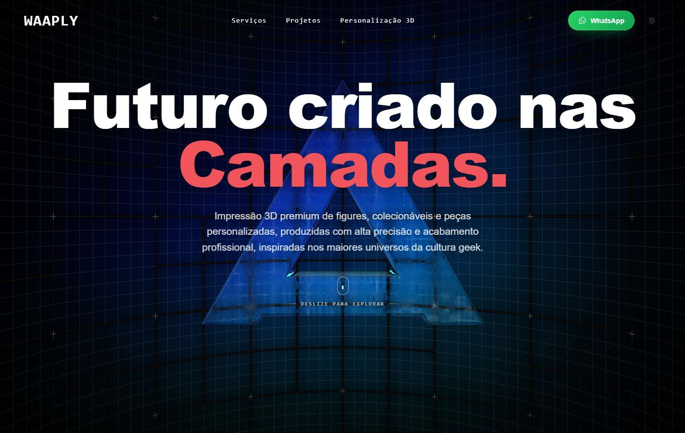
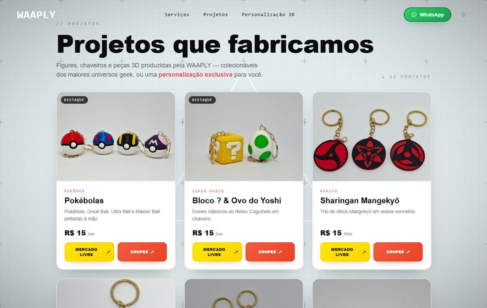
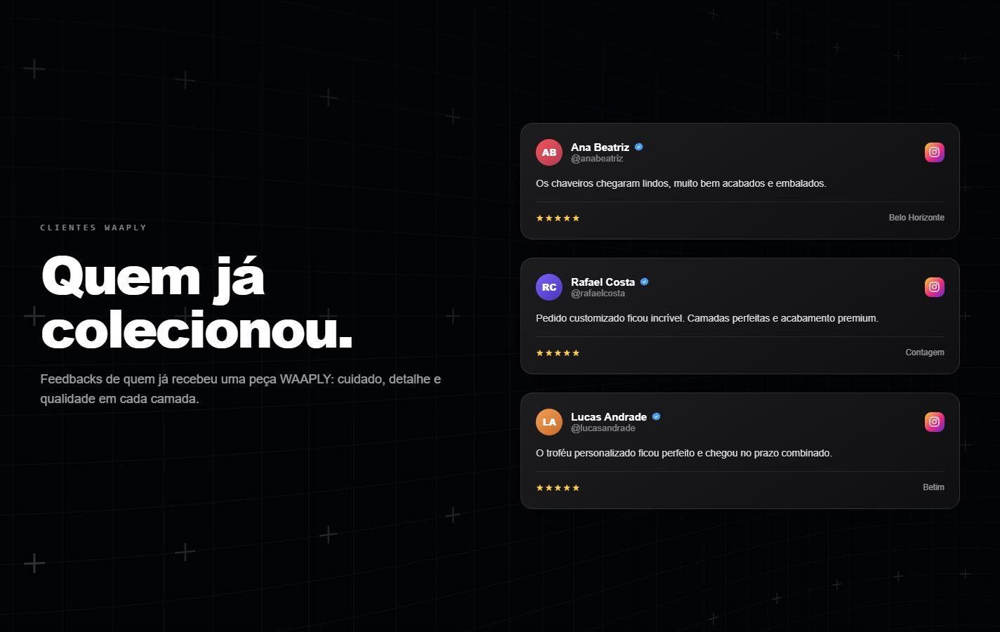
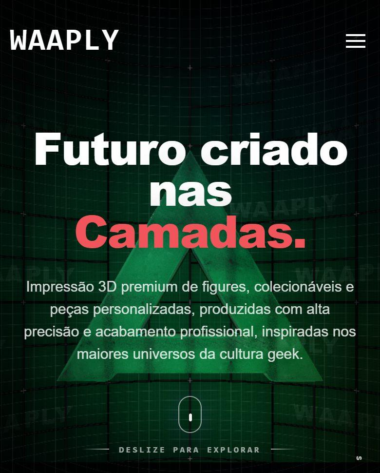

# WAAPLY



> Experiência audiovisual em WebGL para uma marca de impressão 3D de figures e colecionáveis geek. A landing page é conduzida pelo scroll: um prisma renderizado em tempo real atravessa a narrativa até se abrir nas telas de personalização e prova social.

---

## ✦ Sobre

WAAPLY é um estúdio brasileiro de impressão 3D que produz figures, colecionáveis e peças personalizadas. Este repositório contém o site da marca: uma página única que troca a estrutura tradicional de seções empilhadas por uma **narrativa contínua guiada pelo scroll**.

O objetivo do projeto é comercial e de posicionamento: apresentar o catálogo de peças, explicar o processo de produção e converter o visitante em conversa no WhatsApp, sem depender de um catálogo de e-commerce. A escolha por WebGL não é decorativa — o prisma central funciona como fio condutor entre as etapas da página, dando à marca uma presença digital compatível com o acabamento das peças físicas.

A experiência é dividida em cinco momentos: abertura com o prisma e o posicionamento da marca, apresentação do processo produtivo, grade de projetos fabricados, tela de personalização sob encomenda e depoimentos de clientes, encerrando no rodapé de contatos.

---

## ✨ Destaques

- Cena 3D em WebGL renderizada em tempo real, com shaders próprios e environment map em cubemap
- Narrativa dirigida por scroll, com seções sincronizadas ao estado da cena 3D
- Transições de página sem recarregamento
- Tela de carregamento animada em Lottie, com progresso real de assets
- Navegação instantânea por âncoras, no cabeçalho e no menu mobile
- Grade de produtos com links diretos para Mercado Livre, Shopee e orçamento no WhatsApp
- Layout responsivo validado de 320 px a 1920 px, sem scroll horizontal
- Headers de segurança e Content Security Policy prontos para deploy
- Zero scripts de terceiros, zero cookies, zero rastreamento

---

## 🎨 Experiência Visual

A direção de arte parte de um fundo preto quase absoluto (`#08090c`) com uma malha pontilhada sutil, deixando o brilho do WebGL e o coral da marca (`#f2545b`) como únicos pontos de tensão cromática.

A tipografia usa uma pilha sem serifa de peso alto para títulos, com contraste forte entre a linha branca e a linha coral, e uma pilha monoespaçada para rótulos de seção, reforçando a leitura técnica que combina com o universo de fabricação.

O movimento é o principal recurso de composição. O prisma reage ao avanço do scroll, muda de escala e rotação entre as seções e, ao final, "abre" para dar lugar aos painéis de personalização e depoimentos, que ocupam a tela inteira em fundo escuro com efeito de vidro. Os painéis têm estado estável por seção, e não animação contínua, justamente para não atrapalhar a leitura enquanto o visitante para para ler.

---

## ⚙️ Tecnologias

Todas as bibliotecas abaixo foram identificadas dentro do bundle publicado.

| Tecnologia | Versão | Utilização |
| --- | --- | --- |
| Astro | 5.13.3 | Geração do site estático (build de origem) |
| Vite | — | Bundling e code splitting (via Astro) |
| Three.js | r177 | Renderização WebGL, cena 3D, shaders, GLTF |
| GSAP | 3.13.0 | Animações, ScrollTrigger, SplitText, Observer |
| Lenis | — | Scroll suave e sincronização com o ScrollTrigger |
| Swup | 4 | Transições de página sem recarregamento |
| lottie-web | 5.13.0 | Animações vetoriais da tela de carregamento e do outro |
| Howler | 2.2.4 | Camada de áudio (presente no bundle, desativada nesta versão) |
| Tweakpane | 4.0.5 | Painel de ajuste de parâmetros (desativado em produção) |

---

## 🧩 Recursos

```text
🎬  Narrativa audiovisual conduzida pelo scroll
🧊  Cena 3D em WebGL com shaders customizados
🌀  Scroll suave sincronizado com a linha do tempo da cena
🖼️  Grade de projetos com preços e links de compra
💬  Personalização sob encomenda via WhatsApp
⭐  Depoimentos de clientes em cartões estilo Instagram
📱  Responsivo de 320 px a 1920 px, sem overflow horizontal
♿  Respeito a prefers-reduced-motion e contraste WCAG AA
🔐  CSP, HSTS e demais headers de segurança configurados
⚡  Zero requisições a domínios externos
```

---

## 🏗️ Arquitetura

Este repositório contém o **artefato estático já compilado** — não há etapa de build aqui. Os arquivos são servidos exatamente como estão.

```text
waaply/
├── index.html                  # Documento único: markup, estilos inline e navegação por âncora
├── vercel.json                 # Headers de segurança, CSP e política de cache
├── robots.txt                  # Diretiva de indexação
├── favicon.png                 # Ícone do site
├── ogp.jpg                     # Imagem de compartilhamento (Open Graph / Twitter Card)
├── _astro/                     # Bundles gerados pelo Astro/Vite
│   ├── index.astro_..._lang.PrismRestore.js   # Bundle principal: Three.js, GSAP, Lenis, cena e controllers
│   ├── page.SNkKDTDH.js                       # Entrada do Astro e carregamento dinâmico do Swup
│   ├── Swup*.js                               # Swup e seus plugins (a11y, preload, head, scripts, body class)
│   └── *.css                                  # Estilos compilados do layout e das seções
├── common/
│   ├── scene.glb               # Geometria do prisma e elementos da cena
│   ├── loading.svg             # Marca exibida durante o carregamento
│   └── loading/                # Animações Lottie do loader (bg e logo)
├── envmap/                     # Cubemap de iluminação (px, nx, py, ny, pz, nz)
├── projetos/                   # Fotos das peças exibidas na grade de projetos
├── top/                        # Texturas e títulos usados dentro do WebGL
└── 404/                        # Textura da página de erro
```

---

## 🧠 Engenharia

**Renderização.** Uma única cena Three.js alimenta todas as seções. O prisma é carregado de um GLB, iluminado por um cubemap em `envmap/` e desenhado com `ShaderMaterial` próprios; o loop de render é único e compartilhado, evitando múltiplos contextos WebGL na mesma página.

**Sincronização com o scroll.** O Lenis controla a rolagem e alimenta o ScrollTrigger do GSAP, que por sua vez atualiza o atributo `data-current_section` no `<body>`. O CSS reage a esse atributo para revelar ou ocultar cada painel. Como o estado é discreto por seção, e não interpolado quadro a quadro, a leitura permanece estável quando o visitante para de rolar — o snap automático foi desativado justamente por esse motivo.

**Carregamento de assets.** Um gerenciador de carregamento acompanha o progresso real de modelos e texturas e só libera a tela de carregamento quando os recursos críticos estão prontos, o que evita o primeiro quadro com a cena incompleta.

**Navegação.** Os links do cabeçalho e do menu lateral são interceptados por um script inline: em vez de recarregar a página, eles ajustam o estado da seção, rolam até o alvo e atualizam o hash. Isso elimina o intervalo em que o conteúdo aparecia vazio durante a troca de seção.

**Responsividade.** Os painéis de personalização e depoimentos ocupam a altura total do container e centralizam o conteúdo em telas altas, com `align-content: safe center` para nunca cortar o topo quando o conteúdo excede a viewport. Abaixo de 720 px de altura, o painel passa a rolar internamente.

**Tratamento de erros.** Os controllers de seção verificam a existência dos elementos antes de manipulá-los, o que mantém o console limpo mesmo com blocos do template original removidos da página.

---

## 🚀 Execução local

Não há dependências a instalar: o repositório já contém os arquivos finais. Basta servir a pasta por HTTP — abrir o `index.html` direto pelo sistema de arquivos não funciona, porque os módulos ES e o carregamento do GLB exigem origem HTTP.

```bash
git clone <url-do-repositorio>
cd waaply

# qualquer servidor estático serve; exemplos:
npx --yes http-server . -p 4321 -c-1
# ou
python -m http.server 4321
```

Depois acesse `http://localhost:4321`.

---

## 🏗️ Build

**Não se aplica a este repositório.** Ele armazena a saída de build já pronta, então não existem `package.json`, scripts de build, lint ou testes. Alterações são feitas diretamente no HTML, no CSS e nos bundles.

Essa é uma limitação consciente e está registrada em [Limitações conhecidas](#-limitações-conhecidas).

---

## 🌐 Deploy

O projeto é publicável na Vercel como site estático, sem adapter e sem runtime de servidor.

```text
Framework Preset:   Other
Build Command:      (vazio)
Output Directory:   ./
Install Command:    (vazio)
Environment Vars:   nenhuma
```

O arquivo `vercel.json` já define os headers de resposta e a política de cache. Os assets de mídia recebem cache de um dia com revalidação e os bundles usam revalidação obrigatória, porque são editados manualmente e não ganham hash novo a cada alteração.

---

## 🔐 Segurança

Práticas adotadas neste repositório:

- **Sem segredos versionados.** O projeto não usa variáveis de ambiente, não possui backend, banco de dados, autenticação nem chaves de API. Uma varredura por 22 padrões (`API_KEY`, `SECRET`, `TOKEN`, `PRIVATE_KEY`, `AWS_*`, `-----BEGIN`, entre outros) não encontrou credenciais.
- **Sem source maps publicados.** Nenhum arquivo `.map` e nenhuma referência `sourceMappingURL` no bundle.
- **Sem terceiros.** Não há CDNs, fontes externas, analytics nem pixels de rastreamento; o site não grava cookies e usa `localStorage` apenas para a preferência de áudio.
- **Content Security Policy.** Política restritiva definida em `vercel.json`, sem `unsafe-eval` e sem `unsafe-inline` para scripts — os dois scripts inline são autorizados por hash SHA-256. Validada localmente com `report-uri`, sem violações em toda a página.
- **Headers.** `Strict-Transport-Security`, `X-Content-Type-Options`, `X-Frame-Options: DENY`, `Referrer-Policy`, `Permissions-Policy`, `Cross-Origin-Opener-Policy` e `Cross-Origin-Resource-Policy`.
- **Links externos.** Todos os `target="_blank"` usam `rel="noopener noreferrer"`.
- **`.gitignore`** cobre `.env*`, `node_modules/`, `.vercel/`, logs, backups e arquivos de sistema.

> Nenhum sistema é totalmente seguro. Os headers foram validados em ambiente local que replica a configuração de produção; após o primeiro deploy é recomendável reconferir a CSP no domínio real. Se os scripts inline do `index.html` forem alterados, os hashes SHA-256 da CSP precisam ser regerados.

---

## ⚡ Performance

Medições reais feitas em Chromium, desktop 1366x768, servidor local sem compressão e sem throttling:

| Métrica | Valor |
| --- | --- |
| First Contentful Paint | 844 ms |
| Largest Contentful Paint | 844 ms |
| Cumulative Layout Shift | 0 |
| Requisições na carga inicial | 30 |
| Requisições externas | 0 |
| Transferência inicial | ~3,9 MB sem compressão |
| Heap após carga | ~41 MB |
| Long tasks na inicialização | 7, somando ~1,4 s |

Otimizações presentes: code splitting dos plugins do Swup por importação dinâmica, carregamento progressivo de texturas e modelos, reuso de um único contexto WebGL, cubemap em PNG comprimido e cache configurado por tipo de asset no `vercel.json`.

O ponto fraco conhecido é o tempo de bloqueio da thread principal durante a inicialização da cena 3D, consequência do bundle único de 1,78 MB. Reduzi-lo exige rebuild a partir do projeto-fonte.

---

## 📱 Compatibilidade

Validado em Chromium via emulação de dispositivo, verificando ausência de scroll horizontal, console limpo e integridade visual das seções:

| Resolução | Status |
| --- | --- |
| 1920x1080 | ✅ Validado |
| 1366x768 | ✅ Validado |
| 768x1024 | ✅ Validado |
| 430x932 | ✅ Validado |
| 414x896 | ✅ Validado |
| 390x844 | ✅ Validado |
| 320x571 | ✅ Validado |

Navegadores além do Chromium e dispositivos físicos: **em validação**.

---

## 🖼️ Preview

Capturas feitas em Chromium a 1440x900 (desktop) e 390x620 (mobile), com a cena 3D já carregada.

### Abertura


### Projetos que fabricamos



### Personalização 3D


### Depoimentos



### Mobile



> A imagem de compartilhamento social (Open Graph) fica em [`ogp.jpg`](./ogp.jpg).

---

## 📌 Status

```text
🟢 Pronto para deploy
```

Artefato estático validado em navegador: sem erros de console, sem requisições falhando, sem scroll horizontal nas resoluções testadas e com CSP verificada. Não há suíte de build, lint ou testes neste repositório.

---

## ⚠️ Limitações conhecidas

- **Sem projeto-fonte.** O repositório guarda apenas o resultado do build. Manutenções são feitas editando HTML, CSS e bundles minificados, o que limita refatorações maiores.
- **Painel de debug embarcado.** O Tweakpane é instanciado e ocultado por CSS; ele não é acessível por teclado nem visível, mas continua ocupando memória e DOM.
- **Metadados sociais relativos.** `og:url` e `og:image` só ficarão corretos após a definição do domínio; ainda não há `canonical` nem `sitemap.xml`.
- **Movimento reduzido parcial.** `prefers-reduced-motion` desativa animações e transições CSS, mas a narrativa em WebGL continua ativa.

---

## 🗺️ Roadmap

- [ ] Definir o domínio e completar `og:url`, `og:image`, `canonical` e `sitemap.xml`
- [ ] Reconferir CSP e headers no domínio de produção
- [ ] Converter fotos de produtos para WebP/AVIF com fallback
- [ ] Página 404 própria
- [ ] Reconstruir a partir de um projeto-fonte versionado, com code splitting da cena 3D
- [ ] Remover o painel de debug do bundle de produção
- [ ] Validação em dispositivos físicos (iOS e Android) e em Safari e Firefox

---

## 🤝 Contribuição

```bash
git checkout -b feature/nome-da-feature
git commit -m "feat: descreve a mudança"
git push origin feature/nome-da-feature
```

Depois abra um Pull Request descrevendo a alteração, o motivo e como validá-la. Como o repositório não tem build automatizado, inclua no PR as evidências de validação no navegador (console limpo e captura da seção afetada nas resoluções impactadas).

---

## 📄 Licença

```text
License: To be defined
```

---

## 👨‍💻 Autor

**PROEZADEV** — desenvolvimento do site
[github.com/ProezaDEV](https://github.com/ProezaDEV)

Marca e produtos: **WAAPLY**
